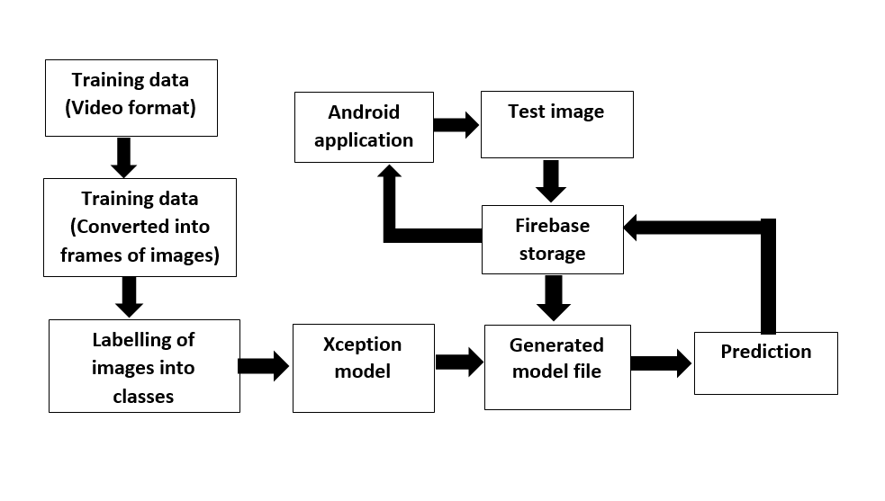
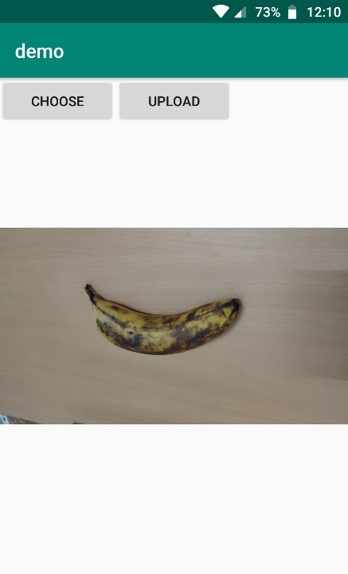

# Fruit-age-estimation
_**An image classifier to estimate the age of fruits.**_

The image classification is done using CNN. Xception model is used for transfer learning and weights are updated according to the training data.\n
The code for training and saving the model is available in [train.py](train.py) and the code for testing in [test.py](test.py)

>The project's flow:

>The android application:

